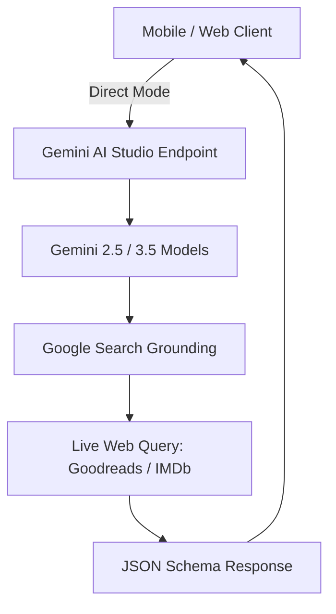

# Library Scanner 📚🎬

**Library Scanner** is a mobile-first, high-premium hybrid application designed to scan book covers and movie/show posters. It instantly retrieves verified, real-time metadata, Goodreads ratings (for books), or IMDb ratings (for movies) using the new Google Gen AI SDK powered by Gemini and Google Search grounding.

---

## ⚡ Quick Start: Mobile Installation

To build and run the mobile app on your physical device, follow these quick steps:

1. **Get a Google AI Studio API Key & Set Up `.env`**:
   - Navigate to [Google AI Studio](https://aistudio.google.com/) and log in with your Google account.
   - Click **Get API key** and generate a new key.
   - In the root directory of this project, create a file named `.env`. You can copy the template:
     ```bash
     cp .env.example .env
     ```
   - Open `.env` in a text editor and add your key:
     ```env
     GEMINI_API_KEY="paste_your_google_ai_studio_api_key_here"
     ```

2. **Install Dependencies**:
   ```bash
   npm install
   ```

3. **Build the Web Assets**:
   ```bash
   npm run build
   ```

4. **Generate native Android assets and sync**:
   ```bash
   npx cap sync
   ```

5. **Create the APK in Android Studio**:
   - Open **Android Studio**.
   - Select **Open an Existing Project** and choose the `android/` directory of this project.
   - Wait for Gradle sync to complete.
   - In the top menu, go to **Build > Build Bundle(s) / APK(s) > Build APK(s)**.
   - When finished, click **Locate** in the bottom-right notification to find the compiled `app-debug.apk`.

6. **Install on your Phone**:
   - Copy the `app-debug.apk` file over to your Android phone (via USB, Google Drive, email, or local sharing).
   - Locate the APK file in your phone's File Manager and tap it to install (enable "Install from unknown sources" if prompted).

---

## ⚙️ Theory & Architecture



### 1. Direct Connection Mode (Serverless)
The client app operates in a pure serverless Direct Mode, bypassing the Node.js server for API processing. The browser client connects directly to Google's API endpoints. API keys can either be injected during compilation via your `.env` file or configured dynamically inside the client-side settings menu (and saved securely to browser `localStorage`).

### 2. Search Grounding & Real-Time Ratings
Standard LLMs suffer from training cutoffs and lack precise catalog rating information. Library Scanner overcomes this by enabling **Google Search Grounding** within the model configuration. 
When a cover is uploaded:
1. Gemini identifies the work from the visual content.
2. A search grounding query is executed to lookup the current live community score (e.g., Goodreads for books or IMDb for movies/shows).
3. The results are parsed and validated against the web grounding sources before being structured into a typed JSON schema.

### 3. Smart Fallback Engine
To maintain service availability and handle model configuration limits:
- **Model Compatibility Fallback**: If a selected model (such as Gemini 3.5) does not support Search Grounding on your credentials (throwing a `400 Bad Request`), the engine catches the exception and immediately retries the request using `gemini-2.5-flash`.

### 4. Thinking Configuration Management
For next-generation Gemini models (3.x+), the SDK configures `thinkingLevel: MINIMAL` to lower generation latency and speed up scan responses. For legacy Gemini models (2.5-flash/lite), thinking budget is turned off (`thinkingBudget: 0`) since thinking is not supported.

---

## 🎨 Premium Aesthetic & Philosophy
Library Scanner employs a high-premium, organic, and minimalist design language:
- **Color Palette**: Alabaster white/beige (`#FAF9F6`), Sage green (`#7D8B7D`), and deep charcoal/olive accents (`#5A5A40`, `#2D2D2D`).
- **Typography**: Editorial serif headers matched with clean sans-serif numerical tags and badges.
- **Micro-interactions**: Smooth card reveals, springy modals, and active scanning wave animations using Motion (Framer Motion).

---

## 📁 Project Structure

```
├── .env.example              # Example environment configuration
├── .gitignore                # Git ignore configuration (.idea, node_modules, android, ios)
├── agents.md                 # Context & instructions for AI coding assistants
├── assets/
│   └── icon.png              # 1024x1024 master application icon source
├── server.ts                 # Express backend API & Vite Dev server entrypoint
├── capacitor.config.ts       # Capacitor native integration config
├── vite.config.ts            # Vite compiler, HMR, and build settings
├── package.json              # Scripts and package dependencies
└── src/
    ├── App.tsx               # Main React entrypoint
    ├── index.css             # Tailwind stylesheet & design tokens
    └── components/
        └── Scanner.tsx       # Core scanning layout, camera feed, and settings UI
```

---

## ⚙️ Development Setup

### Configure Environment Variables
Create a `.env` file in the root directory and define the credentials:
```env
# Google AI Studio API Key
GEMINI_API_KEY="AIzaSyYourAPIKeyHere..."
```

### Run the App Locally
Start the local development server:
```bash
npm run dev
```
Open your browser and navigate to `http://localhost:3000`.

---

## 📱 Mobile Syncing & Asset Generation

> [!NOTE]
> Since mobile devices cannot easily reach `localhost` loopback addresses, you must configure your Gemini API Key directly inside the app's settings menu (gear icon) on your physical phone so that it can make direct requests.

### Generating App Icons & Splash Screens
Capacitor Assets will automatically crop and scale the master icon file (`assets/icon.png`) to fit all required device density slots:
```bash
npx capacitor-assets generate --android
npx capacitor-assets generate --ios
```

---

## 🛡️ License
This project is private and proprietary.
