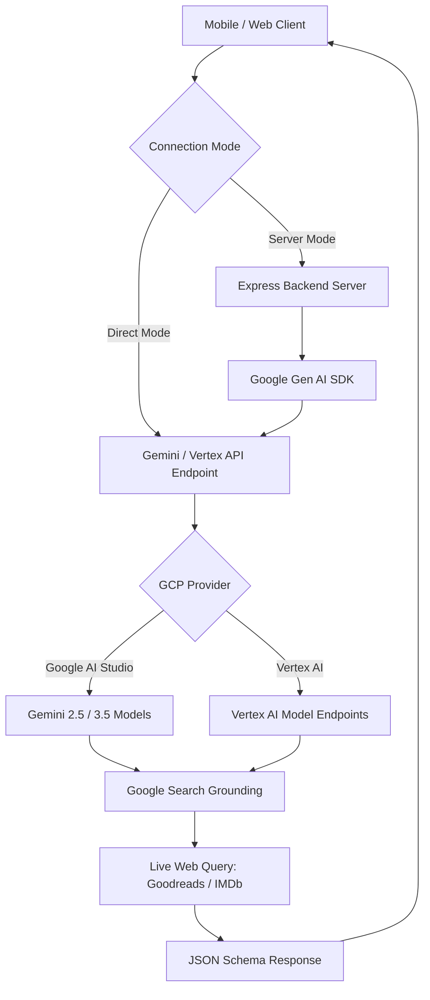

# Library Scanner 📚🎬

**Library Scanner** is a mobile-first, high-premium hybrid application designed to scan book covers and movie/show posters. It instantly retrieves verified, real-time metadata, Goodreads ratings (for books), or IMDb ratings (for movies) using the new Google Gen AI SDK powered by Gemini and Google Search grounding.

Built with React 19, TypeScript, Tailwind CSS 4, Vite 6, and packaged for mobile devices using Capacitor 8.x, it integrates seamlessly with both Google AI Studio (Gemini Developer APIs) and Vertex AI (Google Cloud Platform).

---

## 🎨 Premium Aesthetic & Philosophy
Library Scanner employs a high-premium, organic, and minimalist design language:
- **Color Palette**: Alabaster white/beige (`#FAF9F6`), Sage green (`#7D8B7D`), and deep charcoal/olive accents (`#5A5A40`, `#2D2D2D`).
- **Typography**: Editorial serif headers matched with clean sans-serif numerical tags and badges.
- **Micro-interactions**: Smooth card reveals, springy modals, and active scanning wave animations using Motion (Framer Motion).

---

## ⚙️ Theory & Architecture



### 1. Dual Connection Modes
To ensure developer flexibility, the client app can route requests in two ways:
- **Direct Mode (Serverless)**: Bypasses the Node.js backend server entirely. The browser client connects directly to Google's API endpoints. API keys can either be injected during compilation via your `.env` file or configured dynamically inside the client-side settings menu (and saved securely to browser `localStorage`).
- **Server Mode**: The client makes a POST request to the local Express backend `/api/scan`. The backend server initializes the `@google/genai` SDK using server-side environment variables. This mode is ideal for local development, securing backend credentials, or hosting the application in containerized environments (such as Google Cloud Run).

### 2. Search Grounding & Real-Time Ratings
Standard LLMs suffer from training cutoffs and lack precise catalog rating information. Library Scanner overcomes this by enabling **Google Search Grounding** within the model configuration. 
When a cover is uploaded:
1. Gemini identifies the work from the visual content.
2. A search grounding query is executed to lookup the current live community score (e.g., Goodreads for books or IMDb for movies).
3. The results are parsed and validated against the web grounding sources before being structured into a typed JSON schema.

### 3. Smart Fallback Engine (Direct & Server)
To optimize costs, handle billing caps, and maintain service availability:
- **Model Compatibility Fallback**: If a selected model (such as Gemini 3.5) does not support Search Grounding on your credentials (throwing a `400 Bad Request`), the engine catches the exception and immediately retries the request using `gemini-2.5-flash`.
- **Billing / Quota Fallback**: If the primary API key encounters a quota limit (`429`), billing issue (`402`), or validation error, the engine automatically attempts to complete the request using a **Backup API Key** (if provided). In this fallback mode, Search Grounding is disabled to ensure the request is free/low-cost.
- **Lite Fallback**: If no backup key is configured, the system falls back to running on `gemini-2.5-flash-lite` to try to process the request under standard free tiers.

### 4. Thinking Configuration Management
For next-generation Gemini models (3.x+), the SDK configures `thinkingLevel: MINIMAL` to lower generation latency and speed up scan responses. For legacy Gemini models (2.5-flash/lite), thinking budget is turned off (`thinkingBudget: 0`) since thinking is not supported.

---

## 📁 Project Structure

```
├── .env.example              # Example environment configuration
├── .gitignore                # Git ignore configuration (.idea, node_modules, android, ios)
├── agents.md                 # Context & instructions for AI coding assistants
├── assets/
│   └── icon.png              # 1024x1024 master application icon source
├── server.ts                 # Express backend API & Vite Dev server entrypoint
├── capacitor.config.ts       # Capacitor native integration config
├── vite.config.ts            # Vite compiler, HMR, and build settings
├── package.json              # Scripts and package dependencies
└── src/
    ├── App.tsx               # Main React entrypoint
    ├── index.css             # Tailwind stylesheet & design tokens
    └── components/
        └── Scanner.tsx       # Core scanning layout, camera feed, and settings UI
```

---

## 🚀 Getting Started

### Prerequisites
- [Node.js](https://nodejs.org/) (v18+ recommended)
- `npm` (packaged with Node.js)

### 1. Installation
Clone the repository and install all dependencies:
```bash
npm install
```

### 2. Configure Environment Variables
Create a `.env` file in the root directory and define the credentials:
```env
# Google AI Studio API Key (Primary)
GEMINI_API_KEY="AIzaSyYourAPIKeyHere..."

# Optional Backup API Key (used for free fallback without grounding when primary fails)
GEMINI_API_KEY_BACKUP="AIzaSyYourBackupAPIKeyHere..."

# Optional Vertex AI / Google Cloud Settings
# VERTEX_AI_PROJECT="your-gcp-project-id"
# VERTEX_AI_LOCATION="us-central1"
# VERTEX_AI_API_KEY="your-restricted-gcp-api-key"
```

### 3. Run the App Locally
Start the unified Vite + Express development server:
```bash
npm run dev
```
Open your browser and navigate to `http://localhost:3000`.

---

## 📱 Mobile Hybrid Development (Capacitor)

Library Scanner is designed to run natively on Android and iOS devices.

> [!NOTE]
> Since mobile devices cannot easily reach `localhost` loopback addresses, if you run in **Server Mode**, you should set the **Express Server URL** in the application settings (gear icon) to your machine's local network IP address (e.g. `http://192.168.1.150:3000`). Alternatively, switch to **Direct Mode** to request API queries straight from your phone to Google endpoints.

### Syncing Frontend Changes
Whenever you modify React files inside `/src/`, you must rebuild the web bundle and sync the assets to the native projects:
```bash
npm run build
npx cap sync
```

### Generating App Icons & Splash Screens
Capacitor Assets will automatically crop and scale the master icon file (`assets/icon.png`) to fit all required device density slots:
```bash
npx capacitor-assets generate --android
npx capacitor-assets generate --ios
```

### Android: Building & Testing Debug APKs
To compile the Android package on Windows platforms:
```bash
# Clean and compile debug build
cd android && .\gradlew.bat assembleDebug
```
The output APK will be generated at:
`android/app/build/outputs/apk/debug/app-debug.apk`

---

## 🛡️ License
This project is private and proprietary.
